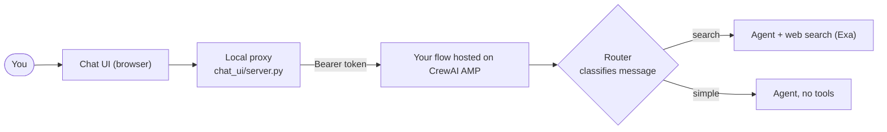
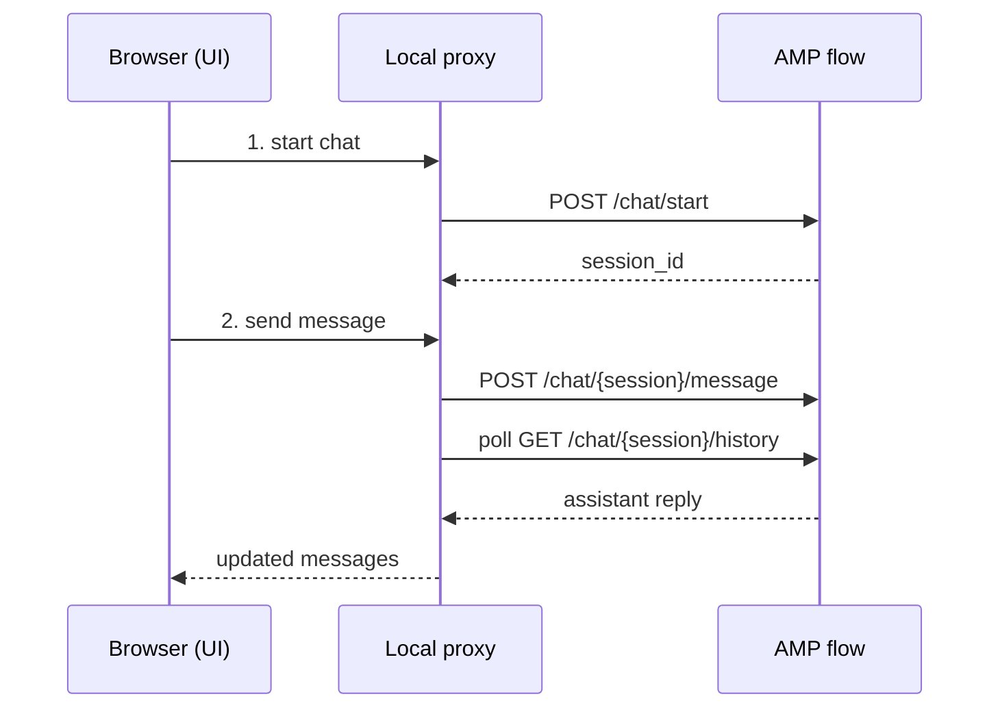

# Conversational Flow + Chat UI (CrewAI AMP example)

A small, beginner-friendly example that shows the whole journey:

1. Build a **conversational flow** with CrewAI (a chatbot that routes each message).
2. **Deploy it to CrewAI AMP** so it becomes a hosted API.
3. Build a **simple web UI** (Discord-like) that chats with that hosted flow.

The goal is to show how a normal application can talk to an automation you host on AMP.

## Big picture



The flow classifies every message into one of two routes:

- **search** - questions that need fresh info from the web (uses the Exa search tool).
- **simple** - everyday chat, answered without any tools.

## The two parts of this repo

| Part | Where | What it is |
| ---- | ----- | ---------- |
| The flow | [src/conversational_flow_example/main.py](src/conversational_flow_example/main.py) | The conversational CrewAI flow (router + two routes). This is what gets deployed to AMP. |
| The UI | [chat_ui/](chat_ui/) | A tiny web app that talks to the deployed flow. |

## Setup

You need Python >=3.10,<3.14 and [uv](https://docs.astral.sh/uv/).

```bash
pip install uv     # if you don't have it
uv sync            # install dependencies
```

Create a `.env` file in the project root:

```bash
# For the flow (web search tool)
EXA_API_KEY=your-exa-key
CREWAI_TRACING_ENABLED=true

# For the UI to reach your deployed flow (from the AMP "Status" tab)
CREWAI_DEPLOYMENT_URL=https://your-flow-url.crewai.com
CREWAI_DEPLOYMENT_KEY=your-flow-token
```

## Try the flow locally (terminal chat)

Before deploying anywhere, you can chat with the flow right in your terminal:

```bash
uv run kickoff
```

Type a message like `search the web for AI news` (uses the search route) or `hello` (simple route). Type `exit` to quit.

## Deploy the flow to AMP

Deploying turns the flow into a hosted API with chat endpoints. It's free to get started.

```bash
uv run crewai login          # free account
uv run crewai deploy create  # deploys this repo
uv run crewai deploy status  # first deploy takes ~1 minute
```

When it's live, copy the **URL** and **token** from the AMP Status tab into your `.env` (`CREWAI_DEPLOYMENT_URL`, `CREWAI_DEPLOYMENT_KEY`).

## Run the chat UI

```bash
uv run chat
```

Then open http://127.0.0.1:8000 and start chatting.

### How the UI talks to AMP

The UI never calls AMP directly. A tiny local proxy holds your token and forwards each message, so the token stays safe and the browser has no CORS problems.



Under the hood the proxy uses these AMP endpoints (see the [Conversational Flow Chat API](https://docs-platform.crewai.com/platform/en/guides/conversational-flow-chat)):

| Proxy route | AMP endpoint | Purpose |
| ----------- | ------------ | ------- |
| `POST /api/start` | `POST /chat/start` | Start a chat session |
| `POST /api/send` | `POST /chat/{id}/message` + poll `/history` | Send a message, wait for the reply |
| `GET /api/history` | `GET /chat/{id}/history` | Load past messages |

## Where to look next

- Change the routes or model: [src/conversational_flow_example/main.py](src/conversational_flow_example/main.py)
- Change the UI look and behavior: [chat_ui/static/](chat_ui/static/)
- Learn more: [Conversational Flows](https://docs.crewai.com/en/guides/flows/conversational-flows) and the [CrewAI docs](https://docs.crewai.com)
